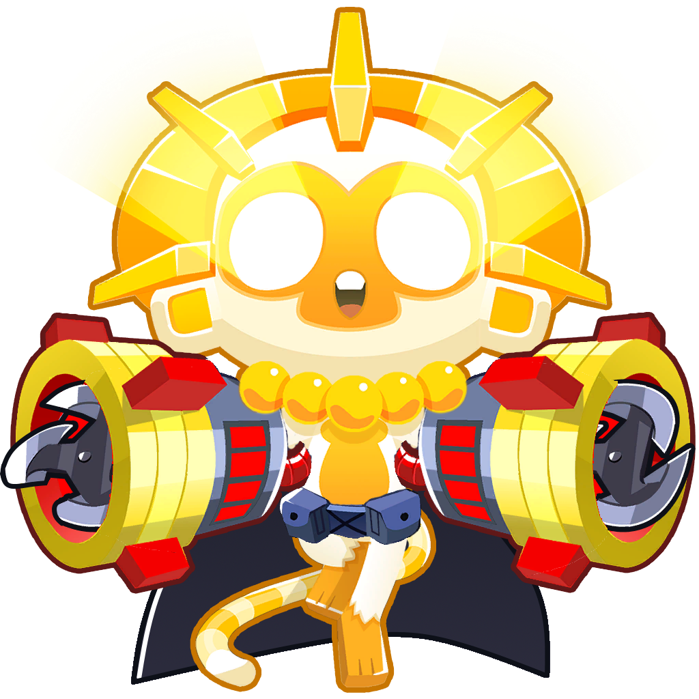
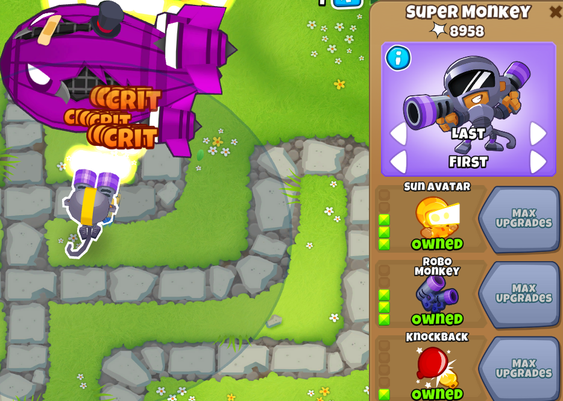

<h1 align="center">

Ultimate Crosspathing

</h1>

### A BTD6 mod enabling more crosspathing combinations through algorithmic generation.

# Summary

With this mod, instead of your Towers being restricted to 5 Upgrades in one path and 2 in another, you can take your
upgrades in any path.

The default mode is keep the restriction of just 7 total upgrades so you can do 430s, 331s, 322s, 511s, etc, but if
you're really adventurous, there's a setting at the bottom of the options list you can enable to allow for all 15
Upgrades. You can also individually toggle which Towers get Ultimate Crosspathing, and changing any settings no longer
requires a restart.

# Quick Answers

### It says "Failed to download asset" when trying to download/update the Mod from the Browser!

The UltimateCrosspathing.dll file is quite beefy. If your internet connection is on the slower side, you may need to increase the Request Timeout duration in the Mod Helper Settings.

### It says "Failed to load Assembly ... No Compaitibility Layer Found!"

[BloonsTD6 Mod Helper](https://github.com/gurrenm3/BTD-Mod-Helper/releases/latest) is not installed correctly. Make sure
that you have the latest version and that you've extracted the zip file so that there's "BloonsTD6 Mod Helper.dll" in
your mods folder with that exact name.

### The cost of an upgrade is some some ridiculously high number?!?

That's the Ninja Kiwi way of saying the tower doesn't exist for you to upgrade to, which usually means Mod Helper isn't
installed correctly. See previous answer. Also check the logs for the mod to see if there was an error generating the
towers. *The cost itself is not the issue*

<h1>Developing Ultimate Crosspathing</h1>

The two solution confiurations of Ultimate Crosspathing, *Debug* and *Release* build the mod in two different ways.

- *Debug* - For each Tower you have enabled in Settings, and to the number of upgrades you have set in the Settings, the corresponding crosspathings will be generated from scratch into the game. The Debug setting to "Export Tower Bytes" becomes available, and pressing it will update the TowerLoader classes and bytes for each tower in the source code.

- *Release* - Instead of generating, it loads in all towers based on what bytes have already been generated and included. The settings then merely determine In-Game crosspathing capability.

The work flow of fixing Ultimate Crosspathing after a new update goes something like:

1. Run the mod built on *Debug* mode with new version with just Dart Monkey enabled at 7 upgrades to see if there's any core generation breakage.

2. If successful, run again with all towers enabled at 7 Upgrades (takes a couple minutes) and attempt to export the bytes.

3. If successful, switch to *Release* mode and attempt loading in all the towers that've been generated.

4. If sucessful, attempt the final generation on *Debug* mode for all towers at 15 upgrades (takes 30+ minutes) and export the bytes.

5. If sucessesful, test the mod and the towers on *Release* mode to see if it's ready for the actual release.

If tower in-game functionality needs to be tested in *Debug* mode, enable the "Post-Merge while Generating" setting. Note that this needs to be off for any generation before the real release.

